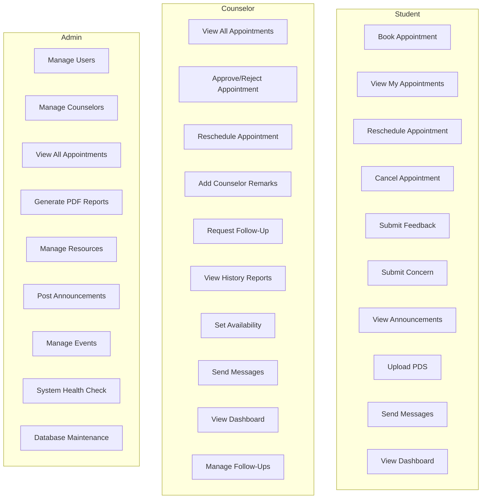

# CounselIgn - Counseling Appointment System

## Project Overview

**Project Name:** CounselIgn  
**Type:** Web-based Counseling Appointment Management System  
**Framework:** CodeIgniter 4 (PHP) with Flask Middleware  
**Database:** MariaDB  
**Core Functionality:** A comprehensive counseling management system enabling students to book appointments, counselors to manage sessions, and administrators to oversee the entire process.

---

## System Architecture

### High-Level Architecture

```
┌─────────────────────────────────────────────────────────────────┐
│                        CLIENT LAYER                              │
│  ┌──────────────┐  ┌──────────────┐  ┌──────────────┐          │
│  │   Student    │  │  Counselor   │  │   Admin      │          │
│  │   Browser    │  │   Browser    │  │   Browser    │          │
│  └──────────────┘  └──────────────┘  └──────────────┘          │
└───────────────────────────┬───────────────────────────────────┘
                            │
                            ▼
┌─────────────────────────────────────────────────────────────────┐
│                      PRESENTATION LAYER                         │
│  ┌──────────────────────────────────────────────────────────┐  │
│  │         CodeIgniter 4 Views & Controllers                  │  │
│  │  • Authentication   • Dashboard    • Appointments          │  │
│  │  • Scheduling       • Messages     • Announcements        │  │
│  │  • PDS Forms        • Reports      • Resources            │  │
│  └──────────────────────────────────────────────────────────┘  │
└───────────────────────────┬───────────────────────────────────┘
                            │
                            ▼
┌─────────────────────────────────────────────────────────────────┐
│                       BUSINESS LAYER                            │
│  ┌──────────────────────────────────────────────────────────┐  │
│  │              Flask Middleware Services                    │  │
│  │  • JWT Authentication    • Session Management            │  │
│  │  • Token Validation      • Security Headers               │  │
│  └──────────────────────────────────────────────────────────┘  │
└───────────────────────────┬────────────────────────���──────────┘
                            │
                            ▼
┌─────────────────────────────────────────────────────────────────┐
│                        DATA LAYER                               │
│  ┌──────────────────────────────────────────────────────────┐  │
│  │                 CodeIgniter Models                        │  │
│  │  • UserModel         • AppointmentModel                   │  │
│  │  • CounselorModel   • FollowUpAppointmentModel            │  │
│  │  • NotificationModel• AnnouncementModel                │  │
│  └──────────────────────────────────────────────────────────┘  │
└───────────────────────────┬───────────────────────────────────┘
                            │
                            ▼
┌─────────────────────────────────────────────────────────────────┐
│                      DATABASE LAYER                             │
│  ┌──────────────────────────────────────────────────────────┐  │
│  │                    MariaDB                                 │  │
│  │  • users              • appointments                       │  │
│  │  • counselors         • follow_up_appointments             │  │
│  │  • counselor_availability • messages                       │  │
│  │  • notifications      • announcements                     │  │
│  │  • resources         • events                             │  │
│  │  • student_personal_info, student_academic_info, etc.     │  │
│  └──────────────────────────────────────────────────────────┘  │
└─────────────────────────────────────────────────────────────────┘
```

### Technology Stack

| Component | Technology |
|-----------|------------|
| Backend Framework | CodeIgniter 4.4+ |
| Middleware | Python Flask |
| Database | MariaDB 10.4+ |
| Authentication | JWT (via Flask Middleware) |
| Frontend | HTML5, CSS3, JavaScript (Vanilla + jQuery) |
| Session Management | CodeIgniter Sessions + Database |
| Email Service | PHPMailer |
| PDF Generation | TCPDF / DOMPDF |

### Database Schema Overview

```
users
├── id, user_id, username, email, password
├── role (student/admin/counselor)
├── is_verified, verification_token
├── profile_picture, last_login, last_activity
│
appointments
├── id, student_id, preferred_date, preferred_time
├── consultation_type, method_type, purpose
├── counselor_preference, description, reason
├── status (pending/approved/rescheduled/completed/cancelled)
├── created_at, updated_at
│
counselors
├── id, counselor_id, name, degree, email
├── contact_number, address, civil_status, sex, birthdate
│
counselor_availability
├── id, counselor_id, available_days, time_scheduled
│
follow_up_appointments
├── id, counselor_id, student_id, parent_appointment_id
├���─ preferred_date, preferred_time, consultation_type
├── follow_up_sequence, description, reason, status
│
student_personal_info
├── student_id, last_name, first_name, middle_name
├── date_of_birth, place_of_birth, age, sex, civil_status
│
student_academic_info
├── student_id, course, year_level, major_or_strand
├── academic_status, school_last_attended
│
student_family_info
├── student_id, father_name, mother_name, guardian info...
│
messages
├── message_id, sender_id, receiver_id, message_text, is_read
│
notifications
├── id, user_id, type, title, message, is_read, related_id
│
announcements
├── id, title, content, created_at, updated_at
│
resources
├── id, title, resource_type, file_name, file_path
├── category, visibility, is_active, upload_count
│
events
├── id, title, description, date, time, location
│
daily_quotes
├── id, quote_text, author_name, category, status
└── submitted_by_id, submitted_by_role
```

---

## Use Case Diagram

### Actors

```
┌─────────────┐     ┌─────────────┐     ┌─────────────┐
│   Student   │     │  Counselor  │     │    Admin    │
└──────┬──────┘     └──────┬──────┘     └──────┬──────┘
       │                   │                   │
       │                   │                   │
       ▼                   ▼                   ▼
┌─────────────┐     ┌─────────────┐     ┌─────────────┐
│ • Book      │     │ • View     │     │ • Manage   │
│   Appointment│    │   Appointments│   │   Users    │
│ • View     │     │ • Approve │     │ • Manage   │
│   My Appts │     │   Appointments│   │   Counselors
│ • Reschedule│    │ • Add     │     │ • View     │
│   Appointment│    │   Remarks │     │   Reports  │
│ • Submit   │     │ • Request │     │ • Generate│
│   Feedback │     │   FollowUp│     │   PDF      │
│ • Submit   │     │ • View    │     │ • Manage   │
│   Concern  │     │   History │     │   Resources│
│ • View     │     │ • Set     │     │ • Post     │
│   Announcements│  │   Availability│  │   Announcements
│ • Upload  │     │ • Send    │     │ • Manage   │
│   PDS      │     │   Messages│     │   Events   │
│ • Send    │     │ • View    │     │ • System  │
│   Messages │     │   Dashboard│    │   Health   │
│ • View    │     │ • Manage │     │ • System  │
│   Dashboard│     │   FollowUp│     │   Maintenance
└─────────────┘     └─────────────┘     └─────────────┘
```

### Complete Use Cases



---

## Activity Diagrams

### 1. Student Book Appointment

```
┌──────────────────────────────────────────────────────────────┐
│                     Student Booking Flow                      │
└──────────────────────────────────────────────────────────────┘

    ┌──────────┐
    │  Start   │
    └────┬────┘
         │
         ▼
    ┌──────────────────┐
    │ Login to System  │
    └────┬─────────────┘
         │
         ▼
    ┌──────────────────────┐
    │ Navigate to Book    │────┐
    │ Appointment        │    │
    └────┬───────────────┘    │
         │                  │
         ▼                  │
    ┌──────────────────┐  │
    │ Select Date/Time  │  │
    └────┬─────────────┘  │
         │                  │
         ▼                  │
    ┌──────────────────┐  │
    │ Select Counselor  │◄──┤
    └────┬─────────────┘  │
         │              │
         ▼              │
    ┌──────────────────┐│
    │ Select Type      ││
    │ (Individual/    ││
    │  Group)        ││
    └────┬───────────┘│
         │            │
         ▼            │
    ┌────────────────┐│
    │ Enter Purpose  ││
    │ & Description ││
    └────┬─────────┘│
         │            │
         ▼            │
    ┌────────────────┐
    │ Submit Request  │
    └────┬───────────┘
         │
         ▼
    ┌─────────────────────┐
    │ Receive Email     │
    │ Confirmation      │
    └────┬──────────────┘
         │
         ▼
    ┌────────────────┐
    │   End          │
    └────────────────┘
```

### 2. Counselor Appointment Management

```
┌──────────────────────────────────────────────────────────────┐
│               Counselor Appointment Management                  │
└──────────────────────────────────────────────────────────────┘

    ┌──────────┐
    │  Start   │
    └────┬────┘
         │
         ▼
    ┌──────────────────┐
    │ Login to System  │
    └────┬─────────────┘
         │
         ▼
    ┌──────────────────┐
    │ View Pending     │────┐
    │ Appointments     │    │
    └────┬─────────────┘    │
         │                  │
         ▼                  │
    ┌──────────────────┐  │
    │ Select Appointment│  │
    └────┬─────────────┘  │
         │                  │
         ▼                  │
    ┌─────────────────────┐
    │ View Appointment   │────┐
    │ Details            │    │
    └────┬──────────────┘    │
         │                  │
         ▼                  │
    ┌────────────────────┐
    │Approve / Cancelled │───────┐
    │  / Reschedule     │       │
    └────┬─────────────┘       │
         │                    │
    ┌────┴──────────────────┴────┐
    │                               │
    ▼         ▼              ▼       │
┌─────────┐ ┌─────────┐ ┌────────┐ │
│Approve  │ │Cancelled   │ │Resched │ │
└────┬────┘ └────┬────┘ └───┬───┘ │
     │           │          │       │
     │           │          │       │
     └───────────┴──────────┴──────┘
              │
              ▼
        ┌──────────────┐
        │ Notify      │
        │ Student     │
        └──────┬──────┘
              │
              ▼
        ┌──────────┐
        │   End    │
        └──────────┘
```

### 3. Admin Report Generation

```
┌────────────────────────────────────────────���─���───────────────┐
│                  Admin PDF Report Generation                  │
└──────────────────────────────────────────────────────────────┘

    ┌──────────┐
    │  Start   │
    └────┬────┘
         │
         ▼
    ┌──────────────────┐
    │ Login as Admin    │
    └────┬─────────────┘
         │
         ▼
    ┌────────────────────┐
    │ Navigate to       │────┐
    │ History Reports  │    │
    └────┬─────────────┘    │
         │                  │
         ▼                  │
    ┌──────────────────┐  │
    │ Select Date     │◄──┤
    │ Range          │  │
    └────┬────────────┘  │
         │                  │
         ▼                 │
    ┌──────────────────┐│
    │ Select Report   ││
    │ Type            ││
    └────┬───────────┘│
         │            │
         ▼            │
    ┌────────────────┐│
    │ Include Filters││
    │ (Status,       ││
    │  Counselor)    ││
    └────┬───────────┘│
         │            │
         ▼            │
    ┌────────────────┐
    │ Click Export   │
    │ PDF Button    │
    └────┬──────────┘
         │
         ▼
    ┌─────────────────────┐
    │ Generate PDF with  │
    │ Timestamp         │
    └────┬──────────────┘
         │
         ▼
    ┌────────────────┐
    │ Download PDF  │
    └────┬──────────┘
         │
         ▼
    ┌──────────┐
    │   End   │
    └──────────┘
```

---

## Sitemap

### User Roles & Pages

```
                                        ┌─────────────────┐
                                        │    Landing      │
                                        │    Page        │
                                        └────────┬────────┘
                                                 │
                                    ┌───────────┴───────────┐
                                    │                   │
                                    ▼                   ▼
                            ┌───────────────┐   ┌───────────────┐
                            │   Login      │   │  Register    │
                            │   Page      │   │  Page        │
                            └──────┬──────┘   └───────────────┘
                                   │
                                   │
                         ┌───────────┴───────────┐
                         │                       │
                         ▼                       ▼
                ┌──────────────┐       ┌──────────────┐
                │    Student   │       │   Counselor  │
                │   Dashboard  │       │   Dashboard  │
                └──────┬───────┘       └──────┬───────┘
                       │                       │
      ┌─────────────────┼─────────────────────┼─────────────────────┐
      │                 │                     │                      │
      ▼                 ▼                     ▼                      ▼
┌────────────┐  ┌────────────┐  ┌────────────┐  ┌────────────┐
│ Schedule   │  │    My      │  │   View All │  │   Set      │
│ Appointment│  │ Appointments│  │ Appointments│  │ Availability│
└─────┬──────┘  └─────┬──────┘  └─────┬──────┘  └─────┬──────┘
     │                │                │                │
     ▼                ▼                ▼                ▼
┌────────────┐  ┌────────────┐  ┌────────────┐  ┌────────────┐
│   PDS      │  │ Follow-Up │  │   History  │  │   Schedule │
│   Form     │  │ Sessions │  │   Reports  │  │   Follow-Up│
└─────┬──────┘  └─────┬──────┘  └─────┬──────┘  └─────┬──────┘
     │                │                │                │
     ▼                ▼                ▼                ▼
┌───��────────┐  ┌────────────┐  ┌────────────┐  ┌────────────┐
│   Profile  │  │ Messages   │  │ Messages  │  │  Messages  │
└────────────┘  └────────────┘  └────────────┘  └────────────┘
     │
     ▼
┌────────────┐  ┌────────────┐  ┌────────────┐  ┌────────────┐
│   Announce │  │ Announcements│ │ Announcements││   Resources│
└────────────┘  └────────────┘  └────────────┘  └────────────┘
     ▼                │                │                │
┌────────────┐       │                │                │
│   Events   │       │                │                │
└────────────┘       │                │                │
     │               │                │                │
     │               ▼                ▼                ▼
     │        ┌────────────┐  ┌────────────┐  ┌────────────┐
     │        │   Admin   │  │   Admin   │  │   Admin   │
     └──────►│   Dashboard│  │   Dashboard│◄─┘  Dashboard│
             └─────┬──────┘  └─────┬──────┘        │
                   │                │                │
                   ▼                ▼                ▼
            ┌────────────┐  ┌────────────┐  ┌────────────┐
            │   Manage  │  │   View All │  │   Database│
            │   Users  │  │ Appointments│ │  Health   │
            └──────────┘  └──────────┘  └──────────┘
                   │                │
                   ▼                ▼
            ┌────────────┐  ┌────────────┐
            │   Manage  │  │   History  │
            │   Counsel│  │   Reports │
            └──────────┘  └──────────┘
                   │                │
                   ▼                ▼
            ┌────────────┐  ┌────────────┐
            │  Announce │  │  Manage   │
            │  Events  │  │  Resources│
            └──────────┘  └──────────┘
```

### Page List by Role

#### Student Pages
- `/` - Landing Page
- `/login` - Login Page
- `/register` - Registration
- `/forgot-password` - Forgot Password
- `/student/dashboard` - Student Dashboard
- `/student/appointment` - Schedule Appointment
- `/student/my-appointments` - My Appointments
- `/student/follow-up-sessions` - Follow-Up Sessions
- `/student/pds` - Personal Data Sheet
- `/student/profile` - Profile
- `/student/messages` - Messages
- `/student/notifications` - Notifications
- `/student/announcements` - Announcements
- `/student/events` - Events

#### Counselor Pages
- `/counselor/dashboard` - Counselor Dashboard
- `/counselor/appointments` - Appointments List
- `/counselor/view-all` - View All Appointments
- `/counselor/availability` - Set Availability
- `/counselor/history-reports` - History Reports
- `/counselor/follow-up` - Follow-Up Management
- `/counselor/profile` - Profile
- `/counselor/messages` - Messages
- `/counselor/notifications` - Notifications
- `/counselor/announcements` - Announcements
- `/counselor/events` - Events

#### Admin Pages
- `/admin/dashboard` - Admin Dashboard
- `/admin/appointments` - All Appointments
- `/admin/view-users` - User Management
- `/admin/counselors` - Counselor Info
- `/admin/resources` - Resources Management
- `/admin/history-reports` - History Reports
- `/admin/announcements` - Announcements
- `/admin/events` - Events
- `/admin/admins-management` - Admins Management
- `/admin/database-health` - Database Health

---

## Mockups

### 1. Student Dashboard

```
┌────────────────────────────────────────────────────────────┐
│ CounselIgn                        [Student: John Doe] [Logout]│
├────────────────────────────────────────────────────────────┤
│ ┌──────────┐  ┌──────────┐  ┌──────────┐  ┌──────────┐        │
│ │Dashboard│  │ Schedule│  │   My    │  │   PDS   │        │
│ │         │  │Appointment│  │Appointments│ │  Form   │        │
│ └──────────┘  └──────────┘  └──────────┘  └──────────┘        │
│ ┌────────┐ ┌────────┐ ┌─────────┐ ┌──────────┐              │
│ │Profile │ │Messages│ │Announce │ │  Events  │              │
│ └────────┘ └────────┘ └─────────┘ └──────────┘              │
├────────────────────────────────────────────────────────────┤
│                                                            │
│   ┌─────────────────────────────────────────────────┐     │
│   │           Welcome, John Doe!                    │     │
│   │                                                 │     │
│   │  ┌─────────────┐  ┌─────────────┐              │     │
│   │  │  Upcoming   │  │  Completed  │              │     │
│   │  │ Appointments│  │  Sessions  │              │     │
│   │  │     2       │  │     5      │              │     │
│   │  └─────────────┘  └─────────────┘              │     │
│   │                                                 │     │
│   │  ┌─────────────┐  ┌─────────────┐              │     │
│   │  │   Pending  │  │   Follow   │              │     │
│   │  │ Appointments│  │   -Ups    │              │     │
│   │  │     1       │  │     0      │              │     │
│   │  └─────────────┘  └─────────────┘              │     │
│   └─────────────────────────────────────────────────┘     │
│                                                            │
│   ┌─────────────────────────────────────────────────┐     │
│   │  Recent Notifications                    View All  │     │
│   ├─────────────────────────────────────────────────┤     │
│   │  • Your appointment has been approved         │     │
│   │  • New announcement: Guidance Office Hours      │     │
│   │  • Appointment reminder: Tomorrow at 2:00 PM  │     │
│   └─────────────────────────────────────────────────┘     │
│                                                            │
└────────────────────────────────────────────────────────────┘
```

### 2. Student Schedule Appointment Form

```
┌────────────────────────────────────────────────────────────┐
│ CounselIgn                        [Student: John Doe] [Logout]│
├────────────────────────────────────────────────────────────┤
│                                                            │
│              ┌──────────────────────────┐                  │
│              │   Schedule Appointment    │                  │
│              └──────────────────────────┘                  │
│                                                            │
│   ┌─────────────────────────────────────────────────────┐    │
│   │                                                     │    │
│   │  Preferred Date: [    ___________    ]              │    │
│   │                                                     │    │
│   │  Preferred Time: [    ___________    ]              │    │
│   │                                                     │    │
│   │  Consultation Type:  ○ Individual  ○ Group       │    │
│   │                                                     │    │
│   │  Method:  ○ Face-to-Face  ○ Online/Virtual        │    │
│   │                                                     │    │
│   │  Counselor Preference: [No Preference ▼]     │    │
│   │                                                     │    │
│   │  Purpose:                                           │    │
│   │  ┌─────────────────────────────────────────────┐   │    │
│   │  │                                             │   │    │
│   │  └─────────────────────────────────────────────┘   │    │
│   │                                                     │    │
│   │  Description:                                      │    │
│   │  ┌─────────────────────────────────────────────┐   │    │
│   │  │                                             │   │    │
│   │  └─────────────────────────────────────────────┘   │    │
│   │                                                     │    │
│   │         [Submit Appointment]                      │    │
│   │                                                     │    │
│   └──────���─���────────────────────────────────────────────┘    │
│                                                            │
└────────────────────────────────────────────────────────────┘
```

### 3. Counselor Dashboard

```
┌────────────────────────────────────────────────────────────┐
│ CounselIgn                        [Counselor: Ms. Cruz] [Logout]  │
├────────────────────────────────────────────────────────────┤
│ ┌──────────┐  ┌──────────┐  ┌──────────┐  ┌──────────┐        │
│ │Dashboard│  │Appointments│ │View All  │  │Availability│       │
│ └──────────┘  └──────────┘  └──────────┘  └──────────┘        │
│ ┌────────┐ ┌─────────┐ ┌──────────┐ ┌──────────┐               │
│ │Reports │ │Follow-Up│ │ Messages │ │ Announce │               │
│ └────────┘ └─────────┘ └──────────┘ └──────────┘               │
├────────────────────────────────────────────────────────────┤
│                                                            │
│   ┌─────────────────────────────────────────────────┐     │
│   │        Welcome, Ms. Cruz!                       │     │
│   │                                                 │     │
│   │  ┌─────────────┐  ┌─────────────┐              │     │
│   │  │   Pending  │  │  Approved  │              │     │
│   │  │    (3)     │  │    (12)    │              │     │
│   │  └─────────────┘  └─────────────┘              │     │
│   │                                                 │     │
│   │  ┌─────────────┐  ┌─────────────┐              │     │
│   │  │   Today    │  │  Scheduled  │              │     │
│   │  │   (2)     │  │    Today    │              │     │
│   │  └─────────────┘  └─────────────┘              │     │
│   └─────────────────────────────────────────────────┘     │
│                                                            │
│   ┌─────────────────────────────────────────────────┐     │
│   │     Pending Appointments (Waiting for Approval)   │     │
│   ├─────────────────────────────────────────────────┤     │
│   │  ┌────────────────────────────────────────────┐ │     │
│   │  │ Student: Juan Dela Cruz                 [✓][✗][~]│    │
│   │  │ Date: 2026-04-07 | Time: 9:00 AM         │ │     │
│   │  │ Type: Individual | Purpose: Academic       │ │     │
│   │  └────────────────────────────────────────────┘ │     │
│   │  ┌────────────────────────────────────────────┐ │     │
│   │  │ Student: Maria Santos                    [✓][✗][~]│    │
│   │  │ Date: 2026-04-07 | Time: 10:00 AM        │ │     │
│   │  │ Type: Group | Purpose: Career              │ │     │
│   │  └────────────────────────────────────────────┘ │     │
│   └─────────────────────────────────────────────────┘     │
│                                                            │
└────────────────────────────────────────────────────────────┘
```

### 4. Admin Dashboard

```
┌────────────────────────────────────────────────────────────┐
│ CounselIgn                              [Admin] [Logout]         │
├────────────────────────────────────────────────────────────┤
│ ┌──────────┐  ┌──────────┐  ┌──────────┐  ┌──────────┐        │
│ │Dashboard│  │Appointments│ │  Users   │  │ Counsel │        │
│ └──────────┘  └──────────┘  └──────────┘  └──────────┘        │
│ ┌──────────┐  ┌──────────┐  ┌──────────┐  ┌──────────┐        │
│ │ Resources│  │ Reports  │  │Announce │  │  Events  │        │
│ └──────────┘  └──────────┘  └──────────┘  └──────────┘        │
│ ┌────────────┐ ┌────────────┐ ┌────────────┐                  │
│ │  Database  │ │    Admins  │ │    Health  │                  │
│ │   Health    │ │ Management│ │           │                  │
│ └────────────┘ └────────────┘ └────────────┘                  │
├────────────────────────────────────────────────────────────┤
│                                                            │
│   ┌─────────────────────────────────────────────────┐     │
│   │           Admin Dashboard                        │     │
│   │                                                 │     │
│   │  ┌──────────┐ ┌──────────┐ ┌─────────────┐   │     │
│   │  │  Total   │ │  Total   │ │  Active    │   │     │
│   │  │ Students │ │Counselors│ │  Admins    │   │     │
│   │  │   150    │ │    5     │ │     3      │   │     │
│   │  └──────────┘ └──────────┘ └─────────────┘   │     │
│   │                                                 │     │
│   │  ┌─────────────┐ ┌─────────────┐              │     │
│   │  │  Total     │ │  Pending   │              │     │
│   │  │ Appointments│ │ Appointments│              │     │
│   │  │    89     │ │     8     │              │     │
│   │  └─────────────┘ └─────────────┘              │     │
│   └─────────────────────────────────────────────────┘     │
│                                                            │
│   ┌─────────────────────────────────────────────────┐     │
│   │              System Health Status               │     │
│   ├─────────────────────────────────────────────────┤     │
│   │  Database:  ● Healthy                          │     │
│   │  Disk Usage: 45% used                          │     │
│   │  Last Backup: 2026-04-05 10:00 PM            │     │
│   └─────────────────────────────────────────────────┘     │
│                                                            │
└────────────────────────────────────────────────────────────┘
```

---

## Prototype Functionality

### Key Features Implemented

#### Authentication System
- JWT-based authentication via Flask Middleware
- Login/Registration with email verification
- Role-based access control (Student, Counselor, Admin)
- Session management with database storage
- Password reset functionality

#### Student Features
| Feature | Description | Status |
|---------|-------------|--------|
| Book Appointment | Schedule new appointment with counselor | ✓ Complete |
| View My Appointments | See all personal appointments with status | ✓ Complete |
| Reschedule | Change appointment date/time | ✓ Complete |
| Cancel | Cancel pending appointment | Planned |
| Submit Feedback | Rate and provide feedback after session | Planned |
| Submit Concern | Submit concerns/issues | Planned |
| Complete PDS Form | Personal Data Sheet submission | ✓ Complete |
| View Announcements | See all announcements | ✓ Complete |
| Send Messages | Message counselors | ✓ Complete |

#### Counselor Features
| Feature | Description | Status |
|---------|-------------|--------|
| View All Appointments | See all scheduled appointments | ✓ Complete |
| Approve/Reject | Approve or reject pending appointments | ✓ Complete |
| Reschedule | Reschedule appointments | ✓ Complete |
| Remove Cancelled | Remove cancelled appointments | Planned |
| Add Remarks | Add counselor remarks to appointments | Planned |
| Request Follow-Up | Request follow-up sessions | ✓ Complete |
| View History | View appointment history | ✓ Complete |
| Set Availability | Set available days/times | ✓ Complete |
| Set "Pending"→"Waiting to Accept" | Change status label | Planned |

#### Admin Features
| Feature | Description | Status |
|---------|-------------|--------|
| Manage Users | View/manage all users | ✓ Complete |
| Manage Counselors | Add/manage counselors | ✓ Complete |
| View All Appointments | See all system appointments | ✓ Complete |
| Generate PDF Reports | Export appointment history to PDF | Planned |
| Manage Resources | Upload/manage files/links | ✓ Complete |
| Post Announcements | Create announcements | ✓ Complete |
| Manage Events | Create/manage events | ✓ Complete |
| Database Health | Check system health | ✓ Complete |

#### Additional Features (Planned)
- Sentiment Analysis for student feedback
- Student concern submission
- Time-stamped PDF report generation
- Notification improvements
- Email notifications for status changes

---

## Data Flow

### Appointment Booking Flow

```
Student                    System                    Counselor
   │                          │                          │
   │  1. Submit Appointment   │                          │
   │ ───────────────────────►│                          │
   │                         │                          │
   │                         │  2. Store Appointment   │
   │                         │ ───────────────────────► │
   │                         │                          │
   │                         │  3. Create Notification │
   │                         │ ───────────────────────► │
   │                         │                          │
   │  4. Email Confirmation   │                          │
   │ ◄──────────────────────┤                          │
   │                         │                          │
   │                         │  5. View Appointment   │
   │                         │ ◄──────────────────────┤
   │                         │                          │
   │                         │  6. Approve/Reject     │
   │                         │ ◄──────────────────────┤
   │                         │                          │
   │  7. Status Update Email │                          │
   │ ◄──────────────────────┤                          │
   │                         │                          │
   ▼                         ▼                         ▼
```

---

## Security Features

- JWT Token Authentication (Flask Middleware)
- Role-Based Access Control (RBAC)
- SQL Injection Prevention (CodeIgniter)
- XSS Protection
- CSRF Protection (CodeIgniter)
- Secure Password Hashing (bcrypt)
- Session Management with Database
- Input Validation & Sanitization

---

## Email Notifications

- Appointment Confirmation
- Appointment Approval/Rejection
- Appointment Reschedule
- Appointment Cancellation
- Follow-up Request
- New Announcement

---

## Report: Progress Status

### Completed Modules (✓)

| Module | Description |
|--------|-------------|
| Middleware | Flask-CodeIgniter JWT authentication middleware |
| Reschedule | Appointment rescheduling functionality |

### In Progress Modules

| Module | Description |
|--------|-------------|
| Remove Cancelled | Remove cancellation function |
| Status Rename | Change "Pending" to "Waiting to Accept" |
| Student Concern | Student concern submission |
| Counselor Remarks | Counselor remarks feature |
| Student Feedback | Post-appointment feedback |
| PDF Reports | Time-stamped PDF export |
| Sentiment Analysis | AI feedback analysis |

### Overall Progress: 26-50%

---

*Document Version: 1.0*  
*Last Updated: 2026-04-06*  
*Project: CounselIgn - Counseling Appointment System*